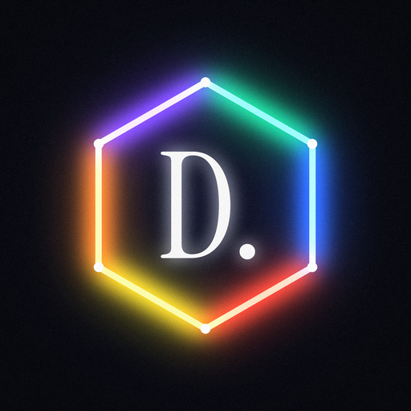

<p align="center"></p>

<h1 align="center">DAM. Discipline & Motivation</h1>

<p align="center"><b>Turn self-improvement into a video game.</b><br>
A free, private, offline iPhone + Mac app for building discipline. You level up, rank up and evolve an avatar by doing the things you said you'd do.</p>

---

DAM is a personal, from-scratch take on the "gamified discipline" style of app (think DAWG). It has the same dark, grainy, neon-hexagon look and the same core loop of daily tasks, XP, ranks and evolution. There's no subscription, no account and no social feed. Everything lives on your devices.

## What's inside

**The core loop**
- **Home**: your evolving avatar, level, rank, XP bar, the week's streak circles and today's tasks as glowing neon cards. Checking a task plays a rising chime (each task climbs the scale), bursts hex particles and floats `+20 XP`.
- **60-day program**: built from a short onboarding questionnaire. You pick focus areas, wake-up time and an intensity (Steady, Locked In or Savage). Tasks level up across three phases: *Foundation → Build → Forge* (e.g. 20 → 30 → 45 min workouts). Week tabs, a 60-hex honeycomb of every day, completion stats.
- **Custom tasks**: any title, stat, difficulty (10–50 XP), specific weekdays and an optional reminder.
- **Streaks**: a day is *secured* when you hit your streak rule (1 task, half or all). Every 7-day streak earns a **shield** that saves one missed day. Streak days stack an XP multiplier up to **x1.5**.

**Progression**
- **6 stats**: Physical, Social, Discipline, Mental, Intellect and Ambition, each rated 1–99, with a hexagonal **OVR** radar. Ratings grow with lifetime XP *and* your last 14 days of consistency. Neglect an area and it slips.
- **28 ranks**: Iron → Bronze → Silver → Gold → Platinum → Diamond → Master → Ascendant → Immortal → Legend, each with a drawn shield badge and a full rank ladder.
- **Evolution**: 10 avatar forms that grow more elaborate as you level (rings, a stat constellation, rays, orbiting sparks, a prism crown). Pick a path: Hunter (Unawakened → The Monarch), Wolf (Pup → Moonbreaker), Warrior (Recruit → Titan) or Monk (Novice → Transcendent).
- **19 achievements** with I/II/III tiers and bonus XP: Iron Will, Early Bird, Centurion, Perfect Week, Deep Work, Arc Conqueror and more.
- **Celebrations**: full-screen level-ups with light rays, rank-up badge reveals, evolution reveals, "Day Secured" flames, PR and program-complete moments, and achievement toasts. All sounds are synthesized just for this app.

**Challenges**
- **Daily challenges**: 3 a day (The Stoic, The Spartan, The Monk, The Ghost…), each from a different stat. Accept one and it joins today's list.
- **Arcs**: multi-day challenges with a live countdown: Winter Arc (90d), Summer Arc, Monk Mode, Dopamine Detox, Iron Arc, Scholar Arc, Road Runner, Social Arc, 5 AM Club, Grind Season and No Excuses. Check in daily and log a metric (miles, pages…). Hit 90% of days to conquer it.

**Tools**
- **Lock In**: focus timer (1 XP/min), keeps the screen awake, notifies you when done.
- **Breathe**: guided Box, 4-7-8, coherent and power breathing with an animated hexagon.
- **Journal**: guided morning and evening prompts, free writing and a mood score.
- **Lift**: workout logger with templates (Push/Pull/Legs/Upper/Lower/Full Body), sets × reps × weight, last-time prefill and automatic PR detection (estimated 1RM).
- **Fuel**: calories, protein and water against your goals, with recent-meal quick add.
- **Coach**: chat coach. It uses **Apple's on-device AI** (free and private) on devices with Apple Intelligence, and falls back to a built-in tough-love coach that reads your stats.
- **Mirror**: accountability mirror. Front camera plus your affirmations, read out loud.
- **Progress card**: shareable image of your level, rank, OVR and stats.

**Also**: morning and evening reminders, per-task reminders, sound and haptics toggles, hardcore mode (missed tasks cost XP), JSON backup export/import, 7 days of automatic backups and free iPhone ↔ Mac sync through an iCloud Drive folder.

## Install (free)

You need a Mac with **Xcode 26 or newer** (free on the Mac App Store) and a free Apple ID.

1. Clone or download this repo and open **`DAM.xcodeproj`**.
2. Select the **DAM** target → **Signing & Capabilities** → set **Team** to your Apple ID (Xcode → Settings → Accounts → add it if needed).
3. If Xcode complains about the bundle identifier, change `com.andyool.DAM` to something unique, e.g. `com.yourname.dam`.

**Mac:** pick **My Mac** as the run destination and press **⌘R**. To keep it, use Product → Archive → Distribute App → Copy App, or drag `DAM.app` from the build products into `/Applications`.

**iPhone:** plug in your iPhone (or pair it over Wi-Fi), select it as the run destination and press **⌘R**.
- First time: on the iPhone, enable **Settings → Privacy & Security → Developer Mode** and trust your developer certificate under **Settings → General → VPN & Device Management**.
- With a *free* Apple ID, iOS apps expire after **7 days**. Just hit Run again from Xcode to refresh; your data is kept. A paid developer account ($99/yr) extends this to a year.

### Syncing iPhone and Mac
Settings → **Sync iPhone ↔ Mac** → *Choose sync folder…* and pick the same iCloud Drive folder (e.g. `iCloud Drive/DAM`) on both devices. DAM merges changes from both sides whenever the app opens or you make a change. No paid account or CloudKit needed.

## How the numbers work

| | |
|---|---|
| Task XP | Easy 10 · Medium 20 · Hard 35 · Savage 50, × streak multiplier (up to x1.5 at 30 days) |
| Level curve | XP to next level = 100 + 10 × level. Level 2 on day one, about level 10 after the first couple of weeks, level 30 around the end of the 60-day program, Legend (125) takes well over a year |
| Stat rating | starting baseline (from onboarding) + up to 40 from lifetime stat XP + up to 25 from the last 14 days |
| Streak shield | +1 per 7 secured days (max 2), auto-used on a missed day |
| Arc conquest | check in on ≥ 90% of days → bonus XP = 6 × days |

## Project layout

```
DAM/
  App/          App entry, tab bar / Mac sidebar, celebrations
  Model/        Game logic (Foundation only): data, leveling, ranks, engine, content, store
  Services/     Sounds & haptics, notifications, coach, iCloud-folder sync
  Design/       Theme, neon components, avatar sigil, rank & achievement badges, radar, effects
  Screens/      Onboarding, Home, Program, Progress, Challenges, Tools/*, Profile, Settings
  Resources/    Asset catalog (icon, grain), Instrument Serif font (OFL), synthesized sounds
Tests/LogicTests/  Game-logic tests: ./scripts/test-logic.sh (macOS or Linux)
```

Single multiplatform SwiftUI target (iOS 17+ / macOS 14+), no third-party dependencies. CI builds both platforms on every push.

---

*Not affiliated with DAWG or DWG Labs. A personal, non-commercial project. All code, art, icon and sounds here are original; the serif font is Instrument Serif under the SIL Open Font License.*
